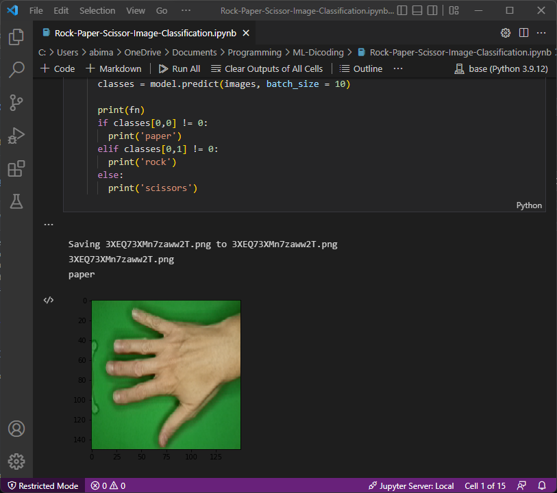

# Rock Paper Scissor Image Classification
## Klasifikasi Rock Paper Scissor Menggunakan TensorFlow
Projek ini bertujuan untuk mengklasifikasikan gerakan tangan dengan kemiripannya pada gerakan Rock Paper Scissor.

### Contoh Output


### Libraries used (python)
```
TensorFlow
Sklearn
``` 

### Dataset
```
Dicoding Academy
``` 
